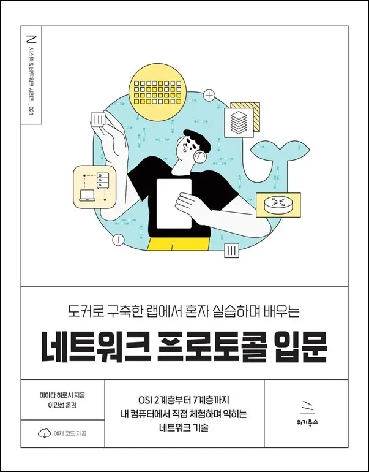

# 도커로 구축한 랩에서 혼자 실습하며 배우는 네트워크 프로토콜 입문
### OSI 2계층부터 7계층까지 내 컴퓨터에서 직접 체험하며 익히는 네트워크 기술

- **미야타 히로시** 지음 | **이민성** 옮김
- ISBN: 9791158396244
- 판형: 188\*240\*17mm
- 32,000원 | 2025년 8월 4일 발행 | 420쪽
- [책 홈페이지](https://wikibook.co.kr/network-protocols/)
- [도서 미리보기](http://www.yes24.com/Product/Viewer/Preview/150118529)
- [도서 관련 문의](https://wikibook.co.kr/support/contact/)

---

**설정부터 패킷 분석까지, 손으로 직접 따라 하며 지식을 실력으로 키워보자!**

이 책은 단순히 지식을 읽고 배우는 것이 아니라, 설정부터 패킷 분석까지 전 과정을 실제로 체험할 수 있는 네트워크 기술서입니다.

한 대의 PC 안에 스위치, 라우터, 방화벽, 로드 밸런서를 갖춘 가상 네트워크 환경을 구축하고, 각 장비에 로그인해 VLAN, 라우팅, 방화벽의 통신 제어, HTTPS 암호화, 로드 밸런싱 등을 모두 실제로 설정하고 동작을 확인할 수 있습니다. 이 책을 통해 네트워크 장비를 설정하고 패킷을 분석하면서 네트워크 검증 환경을 구축하다 보면 실제 구축 현장이나 운영 현장과 유사한 경험을 자연스럽게 쌓고 체험할 수 있을 것입니다.

가상 네트워크 환경은 설정 스크립트를 이용해 간단히 구축할 수 있으며, 현장에서 통하는 확실한 네트워크 기술력을 갖추고 싶은 모든 분께 추천합니다.

**★ 이 책에서 다루는 내용 ★**

- 가상화 기술을 활용한 PC 내 네트워크 검증 환경 구축
- 레이어 2 프로토콜: 이더넷, ARP, L2 스위칭, VLAN
- 레이어 3 프로토콜: IP, ICMP, 라우팅, NAT
- 레이어 4 프로토콜: UDP, TCP, UDP 방화벽, TCP 방화벽
- 레이어 7 프로토콜: HTTP, SSL/TLS, DNS, DHCP, 서버 부하 분산, SSL 오프로드
- 네트워크 장비 설정과 패킷 캡처를 통한 실무 경험 축적
- 리눅스 애플리케이션을 활용한 네트워크 기능 구현
- 문제 발생 시 도움이 되는 명령어 및 트러블슈팅 팁
- 검증 환경에서의 실제 패킷 분석과 네트워크 동작 확인
- AI 시대를 대비한 경험과 체험 기반의 실무 지식 습득

&nbsp;

---

## 구입처

- [예스24](https://www.yes24.com/product/goods/150118529)
- [교보문고](https://product.kyobobook.co.kr/detail/S000217177826)
- [알라딘](https://www.aladin.co.kr/shop/wproduct.aspx?ItemId=368873406)
- [쿠팡](https://www.coupang.com/vp/products/8950556554?itemId=26181139524)

---

## 네트워크 검증 환경 구축용 파일

이 책에서 사용하는 네트워크 검증 환경 구축용 파일은 다음 링크를 통해 내려받을 수 있습니다.

- [윈도우용(tinet.zip) 다운로드](https://github.com/wikibook/network-protocols/raw/refs/heads/main/tinet.zip)

자세한 사용법은 도서를 참고하세요.

맥용 파일은 다음 링크를 통해 내려받을 수 있습니다.

- [인텔 맥용(tinet_mac.zip)](https://github.com/wikibook/network-protocols/raw/refs/heads/main/tinet_mac.zip)
- [M 시리즈 맥용(tinet_mac_m.zip)](https://github.com/wikibook/network-protocols/raw/refs/heads/main/tinet_mac_m.zip)